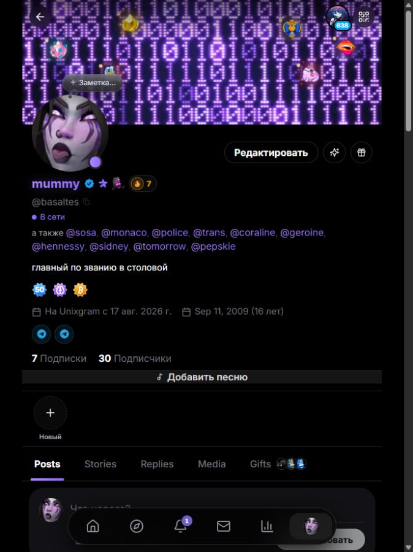
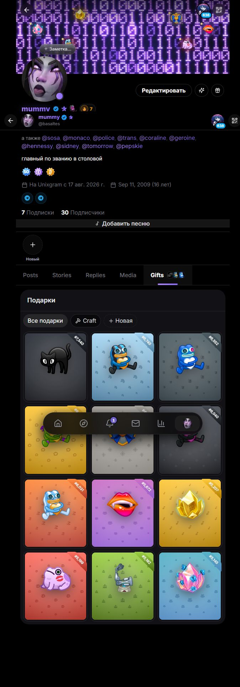

<div align="center">
  

# UnixGram Desktop

## Настоящий UnixGram в отдельном окне Windows

Лента, сообщения, профили, подарки и UnixPlace без лишней вкладки в браузере.

[](https://github.com/jutsu-dev/UnixGramDesktop/releases/latest)
[](https://github.com/jutsu-dev/UnixGramDesktop/releases)
[](https://github.com/jutsu-dev/UnixGramDesktop/releases/latest)
[](LICENSE)

[Скачать релиз](https://github.com/jutsu-dev/UnixGramDesktop/releases/latest) · [Установка](docs/INSTALL-WINDOWS.md) · [Telegram](https://t.me/unixgramhistory) · [Бот](https://t.me/UnixGramHistoryBot) · [Сообщить об ошибке](https://github.com/jutsu-dev/UnixGramDesktop/issues)
</div>

> [!NOTE]
> UnixGram Desktop создаётся сообществом UnixGram History. Это независимый open source проект, неофициальный клиент и не представитель команды UnixGram.

## Почему это удобно

| Что внутри | Что это даёт |
| --- | --- |
| Отдельное окно Windows | UnixGram не теряется среди вкладок и открывается как обычное приложение |
| Системный трей | Лента, сообщения, UnixPlace и настройки доступны рядом с часами |
| Темы, масштаб и режимы окна | Можно быстро настроить внешний вид под свой экран и сценарий |
| Discord Rich Presence | Клиент может показывать активный раздел без переписок, имён и личных данных |
| Сохранённая сессия | После входа не нужно каждый раз заново авторизоваться |
| Настоящий интерфейс UnixGram | Приложение не подменяет сервис самодельной копией и не ломает привычную навигацию |

## Как выглядит

<table>
  <tr>
    <td align="center" width="50%">
      <a href="docs/images/app-main.png">
        
      </a>
      <br>
      <sub>Главное окно с лентой, боковой навигацией и правой колонкой.</sub>
    </td>
    <td align="center" width="50%">
      <a href="docs/images/app-discord.png">
        
      </a>
      <br>
      <sub>Настройки окна, масштаба, Discord Rich Presence и поведения клиента.</sub>
    </td>
  </tr>
  <tr>
    <td align="center" width="50%">
      <a href="docs/images/unixgram-current-profile.png">
        
      </a>
      <br>
      <sub>Профили, бейджи, ссылки и вкладки открываются как в самом UnixGram.</sub>
    </td>
    <td align="center" width="50%">
      <a href="docs/images/unixgram-current-gifts.png">
        
      </a>
      <br>
      <sub>Подарки, коллекции и карточки открываются внутри приложения без браузерной вкладки.</sub>
    </td>
  </tr>
</table>

## Быстрый старт

1. Откройте [последний релиз](https://github.com/jutsu-dev/UnixGramDesktop/releases/latest).
2. Скачайте установщик `.exe` из блока Assets.
3. Сверьте SHA-256 с файлом `SHA256SUMS.txt`.
4. Запустите установщик и войдите в аккаунт.

> [!WARNING]
> Установщик пока не подписан коммерческим Code Signing сертификатом. Windows может показать SmartScreen и издателя "Неизвестный". Скачивайте приложение только из [GitHub Releases](https://github.com/jutsu-dev/UnixGramDesktop/releases) и сверяйте контрольную сумму.

Подробные шаги: [docs/INSTALL-WINDOWS.md](docs/INSTALL-WINDOWS.md)

## Приватность и безопасность

- пароль не сохраняется в исходниках, скриптах или файлах проекта;
- сессия хранится средствами Windows, а не в коде клиента;
- Discord Rich Presence выключен по умолчанию;
- Presence не показывает сообщения, собеседников и содержимое профиля;
- внешние переходы ограничены HTTPS-страницами UnixGram и UnixPlace;
- релизы проверяются локальными тестами, аудитом зависимостей и сканерами секретов.

Подробнее: [SECURITY.md](SECURITY.md) и [PRIVACY.md](PRIVACY.md).

## Что есть в репозитории

| Раздел | Для чего нужен |
| --- | --- |
| [README.md](README.md) | Главная страница проекта, релизы и быстрый старт |
| [CONTRIBUTING.md](CONTRIBUTING.md) | Как прислать баг, идею или правку без лишней путаницы |
| [docs/PROJECT-STRUCTURE.md](docs/PROJECT-STRUCTURE.md) | Карта папок, команд и артефактов |
| [docs/INSTALL-WINDOWS.md](docs/INSTALL-WINDOWS.md) | Установка неподписанной сборки и проверка SHA-256 |
| [docs/RELEASE-CHECKLIST.md](docs/RELEASE-CHECKLIST.md) | Что проверить перед публикацией новой версии |
| [docs/security/sbom.cdx.json](docs/security/sbom.cdx.json) | Состав зависимостей в формате CycloneDX |

## Сборка из исходников

Понадобятся Node.js 22, Rust stable, WebView2 и Visual Studio Build Tools с компонентами C++.

```powershell
git clone https://github.com/jutsu-dev/UnixGramDesktop.git
cd UnixGramDesktop
npm ci
npm run tauri:build:windows
```

Готовый NSIS-установщик появится в `src-tauri/target/release/bundle/nsis/`.

### Локальные проверки

```powershell
npm run lint
npm run build
npm run test:e2e
npm audit --audit-level=high
npm run tauri:test:windows
```

## Стек

<p>
  
  
  
  
  
  
</p>

## Сообщество

| Куда | Ссылка |
| --- | --- |
| Новости проекта | [t.me/unixgramhistory](https://t.me/unixgramhistory) |
| Telegram-бот | [@UnixGramHistoryBot](https://t.me/UnixGramHistoryBot) |
| Профиль автора | [unixgram.com/u/basaltes](https://unixgram.com/u/basaltes) |
| Баг или предложение | [GitHub Issues](https://github.com/jutsu-dev/UnixGramDesktop/issues) |
| Вопрос по безопасности | [SECURITY.md](SECURITY.md) |

## Лицензия

[MIT License](LICENSE) разрешает использовать, изучать, изменять и распространять код при сохранении текста лицензии и уведомления об авторских правах.

<div align="center">
  <a href="https://github.com/jutsu-dev/UnixGramDesktop/releases/latest">
    
  </a>
  <br><br>
  <sub>Сделано сообществом UnixGram History для пользователей UnixGram.</sub>
</div>
