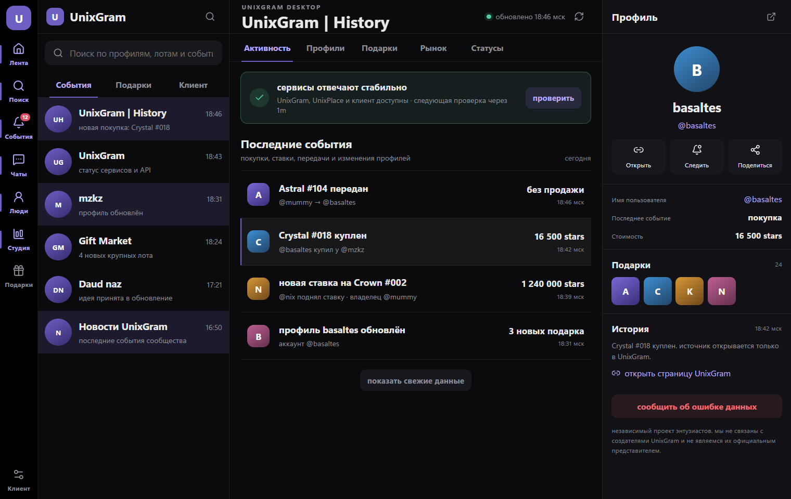
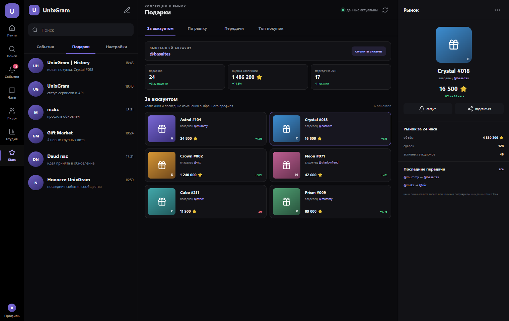
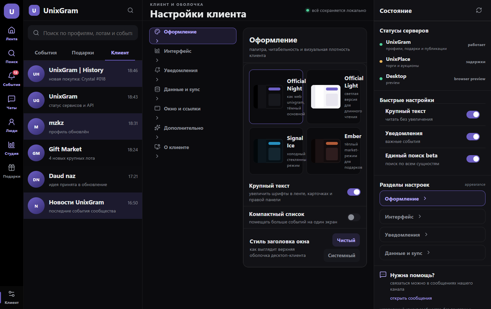

<div align="center">
  

  # UnixGram Desktop

  **UnixGram в отдельном приложении для Windows**

  Лента, сообщения, профили, подарки и UnixPlace без лишней вкладки в браузере.

  [](https://github.com/jutsu-dev/UnixGramDesktop/actions/workflows/release-quality.yml)
  
  
  
  [](LICENSE)

  [Скачать](https://github.com/jutsu-dev/UnixGramDesktop/releases) · [Сообщить о проблеме](https://github.com/jutsu-dev/UnixGramDesktop/issues) · [Безопасность](SECURITY.md)
</div>

<br>



## Что внутри

| | Возможность | Как работает |
|---|---|---|
| 📰 | Лента и профили | Публикации, фото, статусы, галочки и переходы в профили |
| 💬 | Сообщения | Диалоги, ответы, реакции, отметки прочтения и вложения |
| 🎁 | Подарки | Коллекция аккаунта, передачи, покупки, цены и рынок |
| 🔎 | Поиск | Профили, события и подарки в одном месте |
| 🎨 | Оформление | Девять тем, Liquid Glass, масштаб и компактный режим |
| 🖥️ | Windows | Системный трей, полноэкранный режим и окно поверх остальных |
| 🎮 | Discord | Rich Presence без содержимого сообщений |

<table>
  <tr>
    <td width="50%"></td>
    <td width="50%"></td>
  </tr>
  <tr>
    <td align="center"><b>Подарки и рынок</b></td>
    <td align="center"><b>Настройки клиента</b></td>
  </tr>
</table>

## Установка

### Готовая сборка

1. Откройте раздел [Releases](https://github.com/jutsu-dev/UnixGramDesktop/releases).
2. Скачайте файл `UnixGram Desktop_*_x64-setup.exe`.
3. Запустите установщик и войдите в свой аккаунт UnixGram.

> Пока установщик не подписан доверенным сертификатом, Windows может показать предупреждение SmartScreen. Неподписанные сборки считаются тестовыми.

### Сборка из исходников

Понадобятся Node.js 22, Rust stable, WebView2 и инструменты сборки Visual Studio для C++.

```powershell
git clone https://github.com/jutsu-dev/UnixGramDesktop.git
cd UnixGramDesktop
npm ci
npm run tauri:build:windows
```

Установщик появится в `src-tauri/target/release/bundle/nsis/`.

## Вход и данные

Доступны вход по паролю, подтверждение в браузере и QR-код. Пароль не сохраняется. Cookie сессии хранится в Windows Credential Manager, а запросы идут напрямую к `https://unixgram.com` по HTTPS.

Discord Rich Presence выключен по умолчанию. Он не получает тексты сообщений, имена собеседников и содержимое профиля.

Подробнее: [конфиденциальность](PRIVACY.md) и [модель безопасности](SECURITY.md).

## Проверки

```powershell
npm run lint
npm run build
npm run test:e2e
npm run tauri:check:windows
npm run tauri:test:windows
```

Для релизов также запускаются Gitleaks, Trivy, Semgrep и аудит npm. В репозитории хранится [CycloneDX SBOM](sbom.cdx.json). Полный список проверок находится в [релизном чеклисте](docs/RELEASE-CHECKLIST.md).

## Статус

Версия 1.3.0 является release candidate. Основные сценарии и установщик собраны, но стабильный публичный релиз требует цифровой подписи Windows и финальной проверки на чистой системе.

Клиент зависит от web-интерфейсов UnixGram. Если сервис недоступен или изменит формат ответа, отдельные разделы могут временно перестать работать.

## О проекте

UnixGram Desktop развивается командой UnixGram History и участниками сообщества. Это независимый проект. Он не является официальным клиентом и не связан с создателями UnixGram.

Код распространяется по лицензии [MIT](LICENSE).
