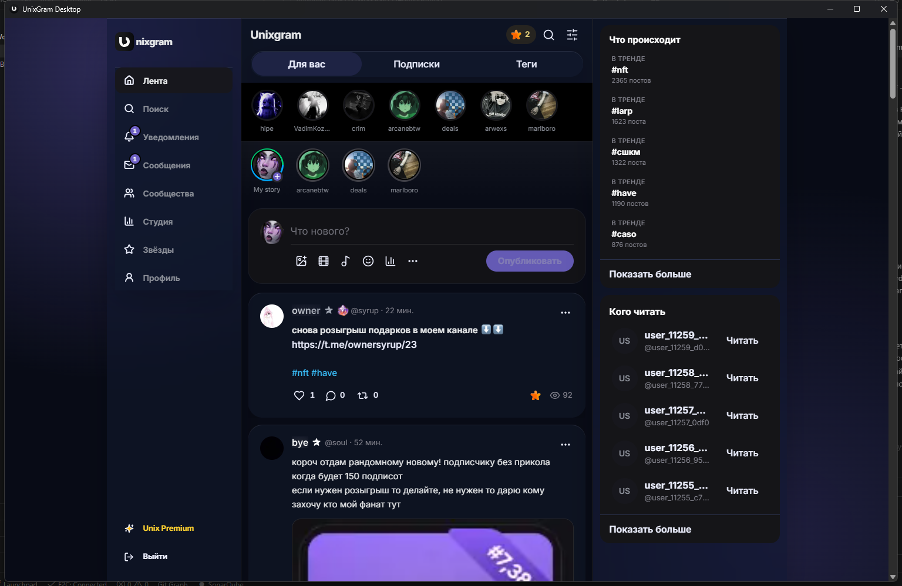
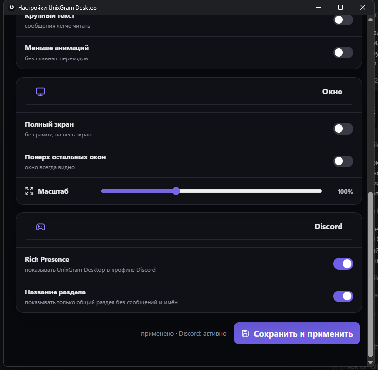

<div align="center">
  

# UnixGram Desktop

> Для разработчиков: [карта папок и команды проекта](docs/PROJECT-STRUCTURE.md).

  ### UnixGram в отдельном приложении для Windows

  Лента, сообщения, профили, подарки и UnixPlace без лишней вкладки в браузере.

  [](https://github.com/jutsu-dev/UnixGramDesktop/releases/latest)
  [](https://github.com/jutsu-dev/UnixGramDesktop/actions/workflows/release-quality.yml)
  [](https://github.com/jutsu-dev/UnixGramDesktop/releases/latest)
  [](https://tauri.app/)
  [](LICENSE)

  [Скачать](https://github.com/jutsu-dev/UnixGramDesktop/releases/latest) · [Как установить](docs/INSTALL-WINDOWS.md) · [Telegram](https://t.me/unixgramhistory) · [Бот](https://t.me/UnixGramHistoryBot) · [Сообщить об ошибке](https://github.com/jutsu-dev/UnixGramDesktop/issues)
</div>

> [!NOTE]
> UnixGram Desktop создан сообществом UnixGram History. Это независимый open source проект, неофициальный клиент и не представитель команды UnixGram.

## Как выглядит

<a href="docs/images/app-main.png">
  
</a>

<p align="center">
  <sub>Настоящий интерфейс UnixGram внутри отдельного окна Windows. Нажмите на снимок, чтобы открыть его полностью.</sub>
</p>

<a href="docs/images/app-discord.png">
  
</a>

<p align="center">
  <sub>Настройки окна, масштаба, оформления и Discord Rich Presence.</sub>
</p>

## Что добавляет приложение

| | Возможность | Что меняется |
|---|---|---|
| 🪟 | Отдельное окно | UnixGram больше не теряется среди вкладок браузера |
| 📌 | Системный трей | Лента, сообщения, UnixPlace и настройки открываются из меню рядом с часами |
| 🎨 | Темы | Девять вариантов оформления, включая OLED, Daylight, Lucifer и basaltes |
| 🔎 | Масштаб | Размер интерфейса настраивается без изменения масштаба всей Windows |
| 🖥️ | Режимы окна | Полный экран, поверх остальных окон и компактные чаты |
| 🎮 | Discord Rich Presence | Показывает общий раздел UnixGram без сообщений, имён и личных данных |
| 🔁 | Восстановление Discord | Rich Presence подключается снова, если Discord запустили позже клиента |
| 🔐 | Сохранение входа | Сессия остаётся в профиле WebView2 и Windows Credential Manager |

Основной экран намеренно не заменяет UnixGram самодельной копией. Клиент открывает актуальный сайт и добавляет только функции Windows-приложения.

## Быстрая установка

1. Откройте [последний релиз](https://github.com/jutsu-dev/UnixGramDesktop/releases/latest).
2. Скачайте `UnixGram.Desktop_1.3.0_x64-setup.exe`.
3. Сверьте SHA-256 с суммой в описании релиза.
4. Запустите установщик.

> [!WARNING]
> Установщик пока не подписан коммерческим Code Signing сертификатом. Windows может показать SmartScreen и издателя «Неизвестный». Скачивайте приложение только из [GitHub Releases](https://github.com/jutsu-dev/UnixGramDesktop/releases) и сверяйте SHA-256. Подробные шаги есть в [инструкции по установке](docs/INSTALL-WINDOWS.md).

## Приватность и безопасность

- пароль не сохраняется в файлах проекта;
- сессия хранится средствами Windows, а не в исходном коде;
- Discord Rich Presence выключен по умолчанию;
- Rich Presence не показывает сообщения, собеседников и имена профилей;
- внешние переходы разрешены только на HTTPS-страницы UnixGram и UnixPlace;
- релиз проходит npm audit, Gitleaks, Trivy, RustSec и автоматические тесты;
- состав зависимостей опубликован в [CycloneDX SBOM](docs/security/sbom.cdx.json).

Подробнее: [политика безопасности](SECURITY.md) и [политика конфиденциальности](PRIVACY.md).

## Сборка из исходников

Понадобятся Node.js 22, Rust stable, WebView2 и Visual Studio Build Tools с компонентами C++.

```powershell
git clone https://github.com/jutsu-dev/UnixGramDesktop.git
cd UnixGramDesktop
npm ci
npm run tauri:build:windows
```

NSIS-установщик появится в `src-tauri/target/release/bundle/nsis/`.

### Локальные проверки

```powershell
npm run lint
npm run build
npm run test:e2e
npm audit --audit-level=high
npm run tauri:test:windows
```

## Стек

<p>
  
  
  
  
  
</p>

## Проект и связь

UnixGram History начинался как Telegram-бот с историей профилей, подарков и рынка. Desktop-клиент продолжает эту идею на Windows: привычный UnixGram остаётся на месте, а полезные функции живут рядом с ним.

| Куда | Ссылка |
|---|---|
| Новости проекта | [t.me/unixgramhistory](https://t.me/unixgramhistory) |
| Telegram-бот | [@UnixGramHistoryBot](https://t.me/UnixGramHistoryBot) |
| UnixGram | [@basaltes](https://unixgram.com/u/basaltes) |
| Ошибка или предложение | [GitHub Issues](https://github.com/jutsu-dev/UnixGramDesktop/issues) |
| Уязвимость | [SECURITY.md](SECURITY.md) |

## Лицензия

[MIT License](LICENSE) разрешает использовать, изучать, изменять и распространять код при сохранении текста лицензии и уведомления об авторских правах.

<div align="center">
  <a href="https://github.com/jutsu-dev/UnixGramDesktop/releases/latest"></a>
  <br><br>
  <sub>Сделано сообществом UnixGram History для пользователей UnixGram.</sub>
</div>
