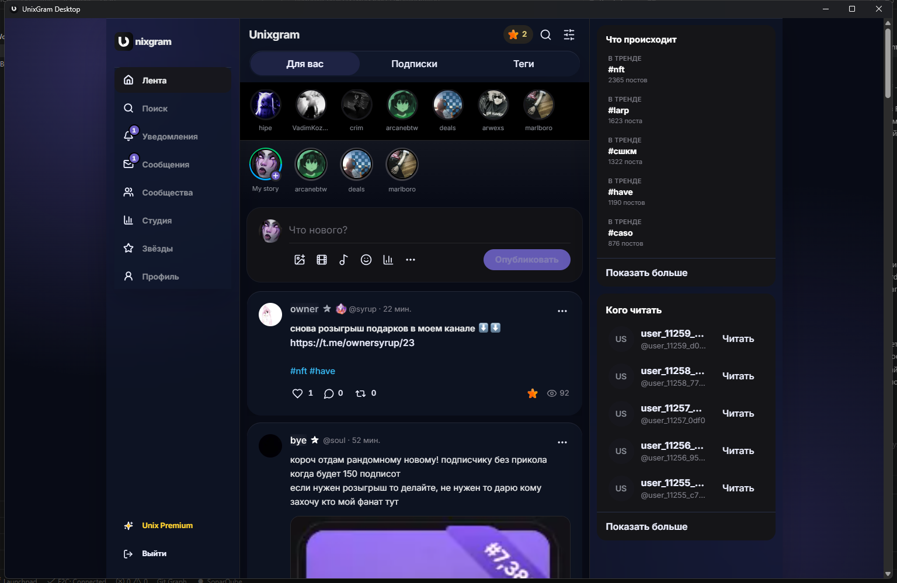

<p align="center">
  
</p>

<h1 align="center">UnixGram Desktop</h1>

<p align="center">Клиент соцсети UnixGram для Windows: сайт в отдельном окне, трей, темы и несколько аккаунтов.</p>

<p align="center">
  <a href="https://github.com/jutsu-dev/UnixGramDesktop/releases/latest"></a>
  <a href="LICENSE"></a>
  <a href="https://github.com/jutsu-dev/UnixGramDesktop/actions/workflows/release-quality.yml"></a>
  
</p>

<p align="center">
  <a href="https://github.com/jutsu-dev/UnixGramDesktop/releases/latest"><b>Скачать последнюю версию</b></a>
  ·
  <a href="docs/INSTALL-WINDOWS.md">Установка</a>
  ·
  <a href="CHANGELOG.md">История изменений</a>
</p>

> [!NOTE]
> Клиент неофициальный. Его делает сообщество UnixGram History, с командой UnixGram проект не связан.

<p align="center">
  
</p>

<table>
  <tr>
    <td align="center"><br><sub>Mexican Pink</sub></td>
    <td align="center"><br><sub>Daylight</sub></td>
    <td align="center"><br><sub>Lucifer</sub></td>
  </tr>
</table>

## Возможности

| | |
| --- | --- |
| Окна | UnixGram и UnixPlace в окнах WebView2. Закрытие окна сворачивает приложение в трей. |
| Трей | Быстрые переходы и счётчик непрочитанных чатов на значке. |
| Аккаунты | До трёх, у каждого свой профиль WebView2. |
| Темы | 13 тем и режим Liquid Glass. |
| Чтение | Размер текста в чатах, меньше анимаций, плавная прокрутка, подчёркивание ссылок. |
| Окно | Полный экран, «поверх остальных окон», масштаб 80–140 %. |
| Уведомления | Число непрочитанных, загрузка файла, восстановление связи. Без текста сообщений и имён. |
| Горячие клавиши | <kbd>Ctrl</kbd>+<kbd>Shift</kbd>+<kbd>1…4</kbd> и <kbd>Ctrl</kbd>+<kbd>Alt</kbd>+<kbd>U/M/G/S</kbd>, работают глобально. |
| Discord | Статус Rich Presence, по желанию с названием раздела. Отключается. |

Ленту, сообщения, профили и подарки отдаёт сайт UnixGram. Если сайт недоступен или его разметка изменилась, клиент может работать с ошибками.

## Установка

1. Скачайте `UnixGram-Desktop-<версия>-x64-setup.exe` и `SHA256SUMS.txt` со страницы [последнего выпуска](https://github.com/jutsu-dev/UnixGramDesktop/releases/latest).
2. Сверьте контрольную сумму со строкой из `SHA256SUMS.txt`:

   ```powershell
   Get-FileHash -Algorithm SHA256 ".\UnixGram-Desktop-1.3.4-x64-setup.exe"
   ```

3. Запустите установщик. Он ставит приложение для текущего пользователя.

> [!WARNING]
> Установщик не подписан, поэтому Windows покажет предупреждение SmartScreen. Скачивайте его только из [GitHub Releases](https://github.com/jutsu-dev/UnixGramDesktop/releases).

Подробности: [docs/INSTALL-WINDOWS.md](docs/INSTALL-WINDOWS.md).

## Сборка из исходного кода

Нужны Windows 10 или 11, [Node.js](https://nodejs.org/) 22, [Rust](https://www.rust-lang.org/tools/install) stable (MSVC), WebView2 Runtime и Visual Studio Build Tools с нагрузкой «Разработка классических приложений на C++».

```powershell
git clone https://github.com/jutsu-dev/UnixGramDesktop.git
cd UnixGramDesktop
npm ci
npm run tauri:build:windows   # установщик в src-tauri\target\release\bundle\nsis
npm run tauri:dev             # запуск для разработки
```

Проверки: `npm run lint`, `npm run typecheck`, `npm run test:e2e`, `npm run tauri:check:windows`, `npm run tauri:test:windows`. Остальные сценарии перечислены в `package.json`.

## Безопасность и конфиденциальность

- Вход идёт на сайте UnixGram внутри WebView2. Пароль приложение не видит и не хранит.
- Сессии лежат в профилях WebView2, у каждого аккаунта свой каталог.
- Нативные команды доступны только локальному окну настроек. Страницы сайта их вызвать не могут.
- В приложении открываются только `unixgram.com`, `www.unixgram.com` и `place.unixgram.com` по HTTPS. Остальные ссылки уходят в системный браузер после подтверждения.
- Своего сервера у проекта нет, телеметрии нет.

Подробнее: [SECURITY.md](SECURITY.md), [PRIVACY.md](PRIVACY.md).

## Архитектура

Нативный процесс на Rust (Tauri 2) держит окна WebView2: окна аккаунтов загружают `https://unixgram.com`, окна UnixPlace — `https://place.unixgram.com`, окно настроек — локальную страницу на React. Процесс внедряет в страницы сайта CSS темы и сценарий счётчика непрочитанных, управляет треем, горячими клавишами и статусом Discord.

Полное описание: [docs/ARCHITECTURE.md](docs/ARCHITECTURE.md).

## Участие в разработке

Порядок работы и обязательные проверки описаны в [CONTRIBUTING.md](CONTRIBUTING.md). Ошибки и предложения — в [Issues](https://github.com/jutsu-dev/UnixGramDesktop/issues/new/choose), об уязвимостях пишите приватно по [SECURITY.md](SECURITY.md). Новости выходят в [Telegram-канале UnixGram History](https://t.me/unixgramhistory).

## Лицензия

[MIT](LICENSE).
